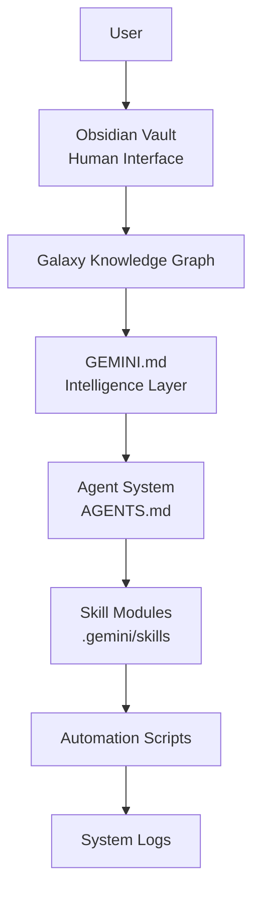
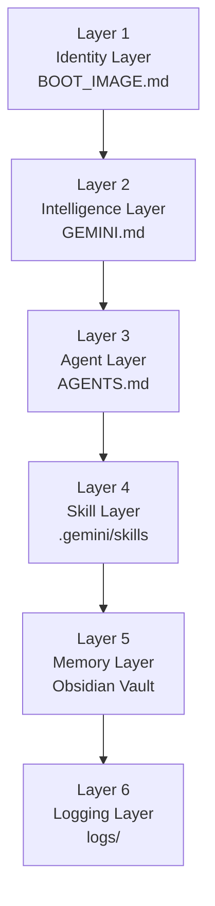
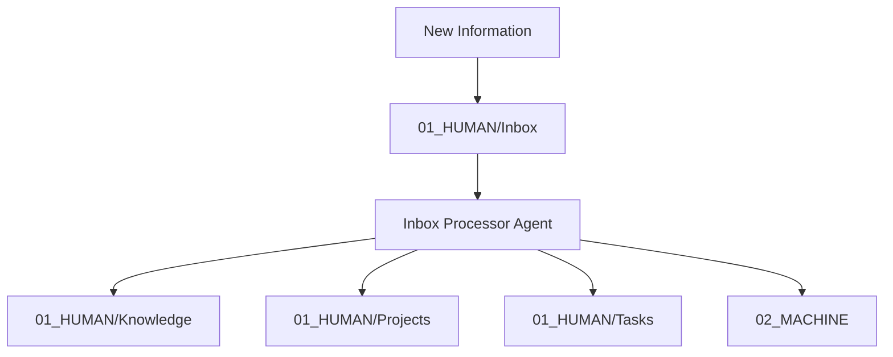
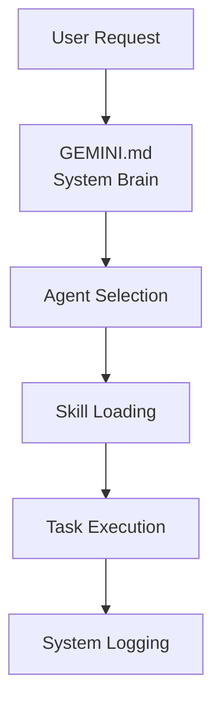

# VANTIS Cognitive Architecture

**Vectorised Astral Navigation & Thought Intelligence System**

Version: 1.0
Architecture Model: Repo-Primary AI Knowledge System

---

# System Overview

VANTIS is a **local-first cognitive AI system** designed to function as a persistent long-memory thinking partner.

The system is built as a **cognitive infrastructure**, not a traditional AI assistant.

Core objectives:

• preserve knowledge
• enhance reasoning
• accelerate learning
• create a compounding intelligence system

VANTIS combines:

* structured knowledge graphs
* persistent memory
* modular AI agents
* strict operational logging
* Git-based configuration
* an Obsidian vault human interface

---

# Repo-Primary Architecture

The system follows a **Repo-Primary model**.

This means:

**Git Repository**

* source of truth for system configuration
* agent definitions
* operational rules
* skill modules

**Obsidian Vault**

* human interface
* long-term knowledge memory
* knowledge graph navigation

---

# High Level System Flow



---

# VANTIS Architecture Layers

The system is composed of **six architectural layers**.



---

# Memory Architecture

VANTIS maintains **two distinct memory systems**.

## Human Memory

Location

```
01_HUMAN/Daily/
```

Purpose

* daily reflections
* learning summaries
* decisions
* insights

Example

```
2026-03-14.md
```

---

## System Logs

Location

```
logs/
```

Purpose

* system auditing
* traceability
* debugging
* operational transparency

Example

```
logs/2026-03-14/interaction-001.md
```

---

# Vault Structure

The Obsidian vault acts as the **long-term memory layer of the system**.

```
03_SYSTEM/Protocols
01_HUMAN/Inbox
01_HUMAN/Knowledge
01_HUMAN/Projects
01_HUMAN/Personal
01_HUMAN/Tasks
02_MACHINE
```

---

# Knowledge Graph — The Galaxy

Location

```
01_HUMAN/Knowledge/Galaxy
```

Rules

• one concept per note
• flat structure
• connected via wikilinks
• only human-generated knowledge

AI outputs **must never enter the Galaxy**.

This prevents knowledge contamination.

---

# Knowledge Flow



---

# Intelligence Flow



---

# Agent System

VANTIS operates as a **multi-agent intelligence system**.

Example agents

* Knowledge Architect
* Memory Curator
* Inbox Processor
* Security Architect
* Research Analyst
* LinkedIn / Marketing Strategist

Each agent has:

* defined expertise
* activation conditions
* operational scope
* domain restrictions

---

# Skill System

Skills define **agent behaviour**.

Location

```
.gemini/skills/
```

Example skills

```
memory-curator
inbox-processor
knowledge-architect
```

Skills are **lazy loaded**.

Only the skill description loads initially.
Full instructions load only when required.

This prevents context overload.

---

# Logging System

Every AI interaction must generate a log entry.

Log structure

```
timestamp
user_request
agent_activated
files_read
files_modified
reasoning_summary
outcome
```

Example location

```
logs/2026-03-14/interaction-001.md
```

---

# Knowledge Integrity Model

VANTIS enforces strict separation between **human knowledge** and **AI generated output**.

Human knowledge

```
01_HUMAN/Knowledge/Galaxy
```

AI output

```
02_MACHINE
```

System logs

```
logs/
```

This prevents **knowledge contamination and model collapse**.

---

# Core Operating Principle

VANTIS is a **compounding intelligence system**.

Every interaction should:

* generate insight
* strengthen the knowledge graph
* improve reasoning
* enhance future decision making

The system becomes **more intelligent over time** as knowledge compounds.
